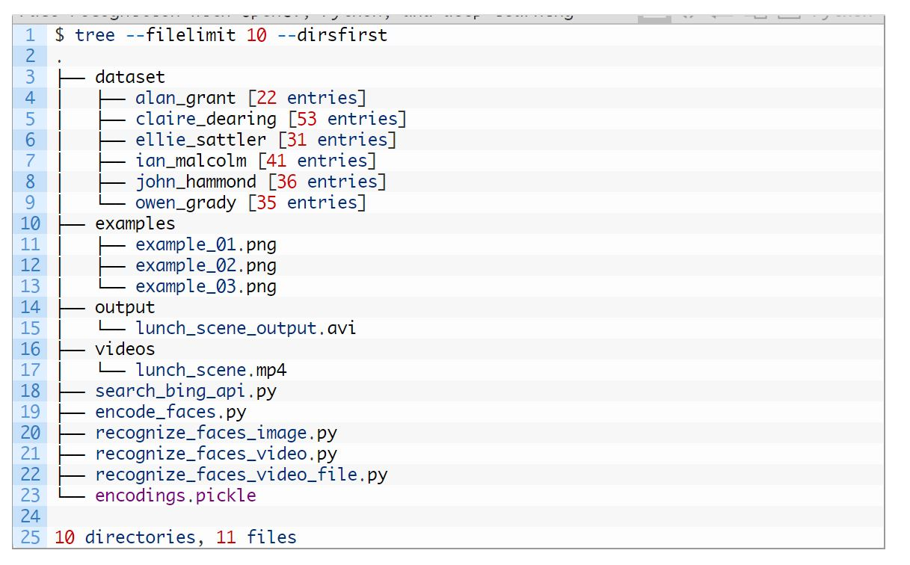

## 綱要:
#
#### 1. 訓練自己的 haar 
####    {[Linux code](https://drive.google.com/open?id=1W2VHb_NTAAzGEsJ3Ul75TI2cKg1QP744)}
####    {[Windows code](https://github.com/sauhaardac/Haar-Training)}{[Readme](https://github.com/jumbokh/cv_face/blob/master/opencv/day3/HAAR_Train_win.md)}
#### 2. 創建DataSet-1. Bing Search {[python code](https://drive.google.com/open?id=1Y7u7oGlEBsJjhyjnWjiImXSuW9dVPO0n)}
#### 3. 創建DataSet-2. ImageNet
#### 4. Face Recognition {[Github](https://github.com/ageitgey/face_recognition)}
#### 
#### DataSet Directory Structure:

#
## 首次登入
### login: pi
### 密碼: raspberry
### $ workon cv
### (cv) $ wget https://github.com/jumbokh/cv_face/blob/master/opencv/day3/requirements.txt
### (cv) $ pip install -r requirements.txt
## 測試
### (cv)$ python
### >>> import cv2
### >>> cv2.\__version\__
###
### 相關連結:
* [pyImage Course](https://drive.google.com/open?id=12VqnvwSKpAGAU9GA7P2MChLAPAJFghx2)
* [How to (quickly) build a deep learning image dataset](https://www.pyimagesearch.com/2018/04/09/how-to-quickly-build-a-deep-learning-image-dataset/)
* [Bing Image Search API](https://azure.microsoft.com/en-us/services/cognitive-services/bing-image-search-api/)
* [Quickstart: Search for images using the Bing Image Search REST API and Python](https://docs.microsoft.com/en-us/azure/cognitive-services/bing-image-search/quickstarts/python)
* [Resource Guide: Image Processing](https://drive.google.com/drive/u/1/folders/12VqnvwSKpAGAU9GA7P2MChLAPAJFghx2)
* [ppt for haar training](https://github.com/jumbokh/cv_face/blob/master/opencv/Book/FT700-ch12.ppt)
* [Face recognition with OpenCV, Python, and deep learning](https://www.pyimagesearch.com/2018/06/18/face-recognition-with-opencv-python-and-deep-learning/)
* [HAAR Training](https://drive.google.com/open?id=1W2VHb_NTAAzGEsJ3Ul75TI2cKg1QP744)
* [Face Recognition opencv](https://drive.google.com/open?id=1Y7u7oGlEBsJjhyjnWjiImXSuW9dVPO0n)
* [Face Recognition (github)](https://github.com/ageitgey/face_recognition.git)
* [ImageNet](http://www.image-net.org/)
